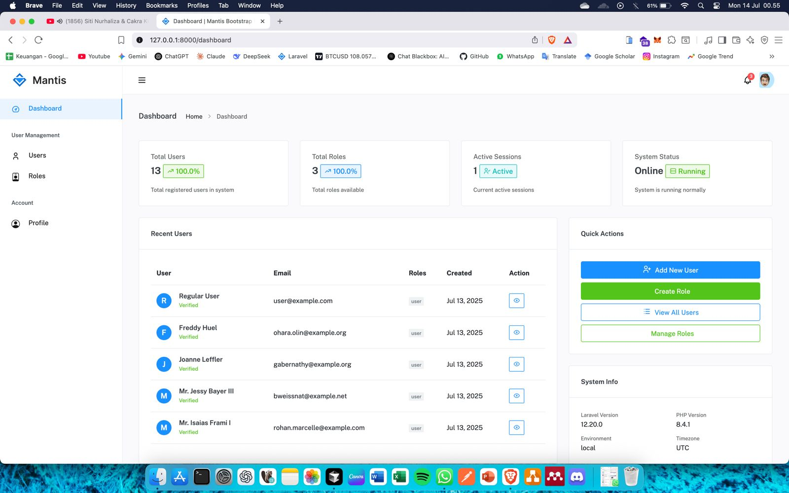
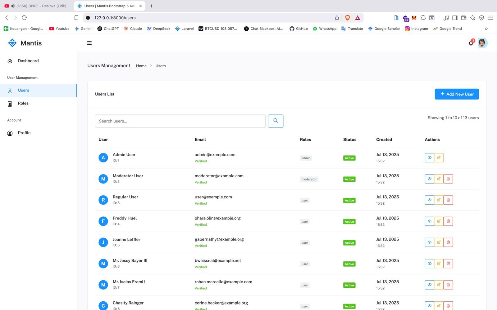
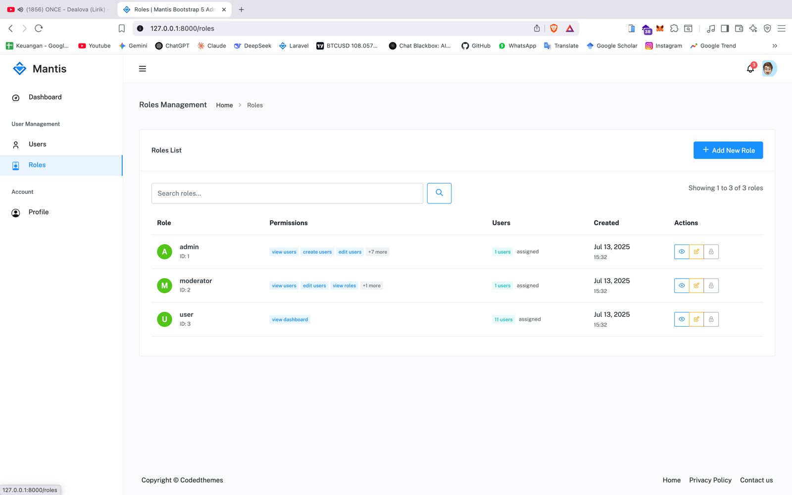
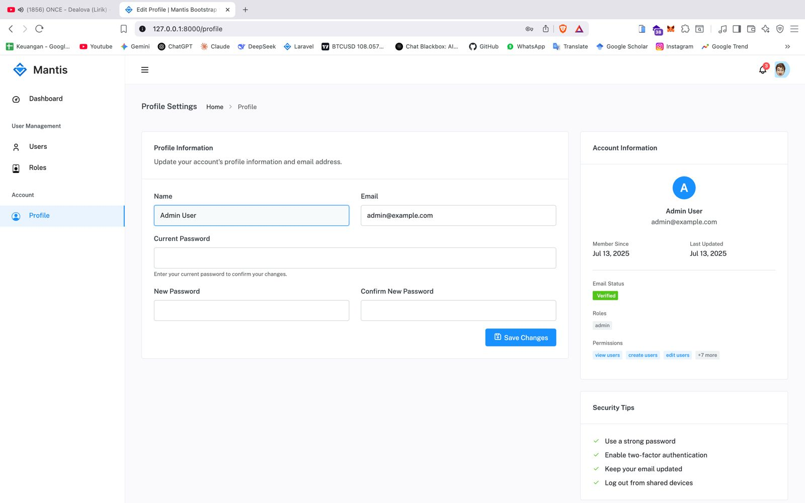

# laravel12_dynamic_role

Laravel 12 User Management & Dynamic Role

Sistem manajemen user dan role berbasis Laravel 12, dengan fitur autentikasi, manajemen role & permission (Spatie), UI modern (Mantis Bootstrap 5), dan siap pakai untuk aplikasi admin.

## Fitur Utama
- Login & Register modern
- Manajemen User, Role, dan Permission
- Role & Permission dinamis (Spatie)
- UI responsive, sidebar, dashboard, dsb
- Pagination, search, permission-based menu
- Notifikasi & validasi

## Screenshot

### Dashboard


### Users


### Roles


### Profile


## Cara Install & Setup

1. **Clone repository**
   ```bash
   git clone https://github.com/Sebehhhh/laravel12_dynamic_role.git
   cd laravel12_dynamic_role
   ```
2. **Install dependency PHP**
   ```bash
   composer install
   ```
3. **Copy file .env**
   ```bash
   cp .env.example .env
   ```
4. **Generate app key**
   ```bash
   php artisan key:generate
   ```
5. **Atur koneksi database**
   - Edit `.env` bagian DB_DATABASE, DB_USERNAME, DB_PASSWORD sesuai database lokal kamu.
6. **Jalankan migrasi & seeder**
   ```bash
   php artisan migrate --seed
   ```
7. **Install dependency frontend**
   ```bash
   npm install && npm run build
   # atau
   yarn && yarn build
   ```
8. **Jalankan server**
   ```bash
   php artisan serve
   ```

## Login Default
- **Admin:**
  - Email: `admin@example.com`
  - Password: `password`
- (Cek DatabaseSeeder untuk user lain)

## Lisensi
Lisensi komersial, silakan gunakan untuk project pribadi/komersial. Dilarang memperjualbelikan ulang tanpa izin.
